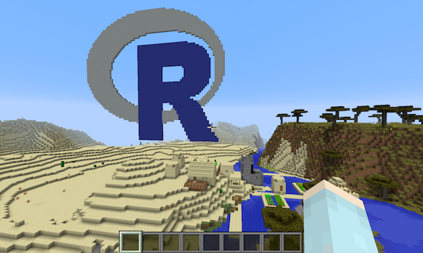

# Rendering the R logo in Minecraft


As a further illustration of use of the
[miner](https://github.com/ropenscilabs/miner) package to interact
with Minecraft from R, here I will render the R logo within Minecraft.

## Load and prepare an image file

First, let's download the image file from the web.
We'll load it directly into R from the web using the
[imager](https://cran.r-project.org/package=imager) package.


```r
library(imager)
url <- "https://www.r-project.org/logo/Rlogo.png"
logo <- load.image(url)
```

Print to see the size of the image.


```r
logo
```

```
## Image. Width: 800 pix Height: 700 pix Depth: 1 Colour channels: 4
```

The image is stored as a 4-dimensional array: horizontal and vertical
position, time, and color.


```r
dim(logo)
```

```
## [1] 800 700   1   4
```

Let's reduce the size to 80x70.


```r
logo <- resize(logo, 80, 70)
```

There is a bit of shading in the logo, but mostly there are three
colors: transparent, gray, and blue. If we look at a histogram of the
first color channel (red), we can see the three pieces:


```r
par(mar=c(5.1,4.1,0.6,0.6), las=1)
hist(logo[,,,1], breaks=100, main="",
     xlab="Red color intensity")
```


So let's truncate at 0.05 and 0.4.


```r
logo[] <- cut(logo, c(-Inf, 0.05, 0.4, Inf))
logo <- logo[,,1,1]
```

## Render in Minecraft

Now let's load the [miner](https://github.com/ROpenSciLabs/miner)
package, connect to the MineCraft server, and find a spot to place the
logo.


```r
library(miner)
mc_connect()
host_pos <- getPlayerPos()
host_pos[2] <- host_pos[2] + 10
```

Now let's render the R logo using gray and blue wool, leaving parts
transparent.

First, we pick out the blue and gray wool blocks, to get the item and
style IDs.


```r
blue <- find_item("Blue Wool")
gray <- find_item("Light Gray Wool")
```

Now we try rendering the logo.


```r
for(i in 1:nrow(logo)) {
    for(j in 1:ncol(logo)) {
        if(logo[i,j] == 2)
            setBlock(host_pos[1]+(nrow(logo)-i),
                     host_pos[2]+(ncol(logo)-j),
                     host_pos[3],
                     blue[2], blue[3])
        if(logo[i,j] == 3)
            setBlock(host_pos[1]+(nrow(logo)-i),
                     host_pos[2]+(ncol(logo)-j),
                     host_pos[3],
                     gray[2], gray[3])
    }
}
```

The result looks like this:


