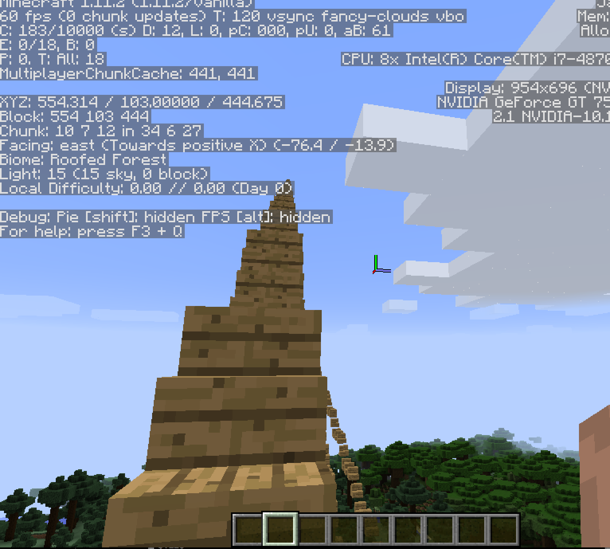

# A Stairway to Heaven

## Building Objects

The function to create objects in `miner` is the `setBlock` function. It expects four arguments, the first three being the coordinates of your item's location, and the fourth being the `block_id` you want to set. An optional argument is `block_style`.

First, you need to find out where you are. You can use `getPlayerIds` to get the ids of all players currently in the Minecraft world. You can use the `getPlayerPos` function to find the position of each player. If you are the first player, you can pull your ID as the first element of the object returned by `getPlayerIds`:


```r
ids <- getPlayerIds()
lapply(ids, getPlayerPos)
ali <- ids[1]
```

## Stairway to heaven

We will create a matrix that contains our increments. First we create a matrix with as many columns as we want stairs, and three rows specifying our coordinates. The coordinates are obtained by incrementing the first and second element of each column. We then use `purrr:map` to input that matrix to the `setBlocks` function.


```r
pos <- getPlayerPos(player_id = ali, tile = TRUE)
stair_blocks <- 10

stepsize <- 1

stairs <- replicate(stair_blocks, pos)
upset <- cbind(rep(0, 3), replicate(stair_blocks - 1, c(1, 1, 0)))
t_upset <- t(apply(upset, 1, cumsum))

t_stairs <- stairs + t_upset

library(tidyverse)

d_stairs <- as.data.frame(t_stairs) %>% tbl_df

d_stairs %>% map(function(x) setBlock(x[1], x[2], x[3], id = 53))
```

Here is an example of the resulting stairway:


